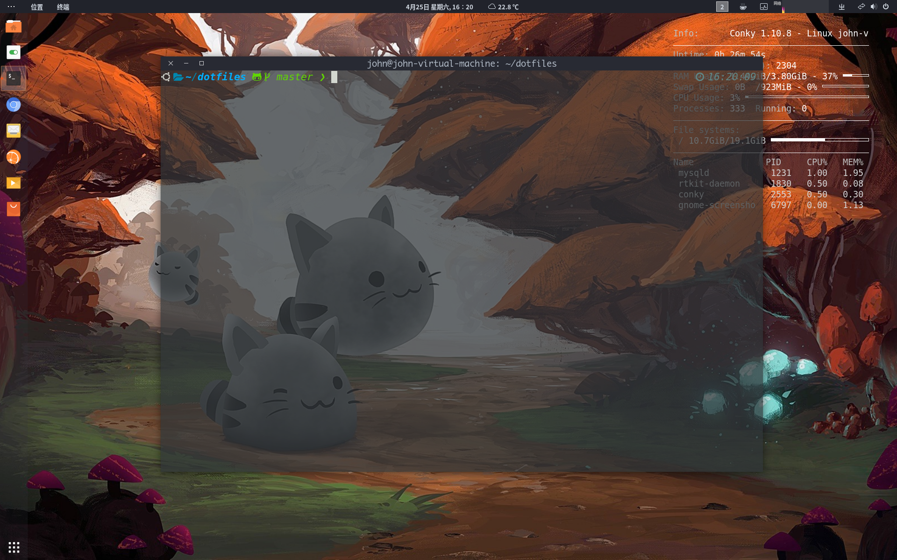
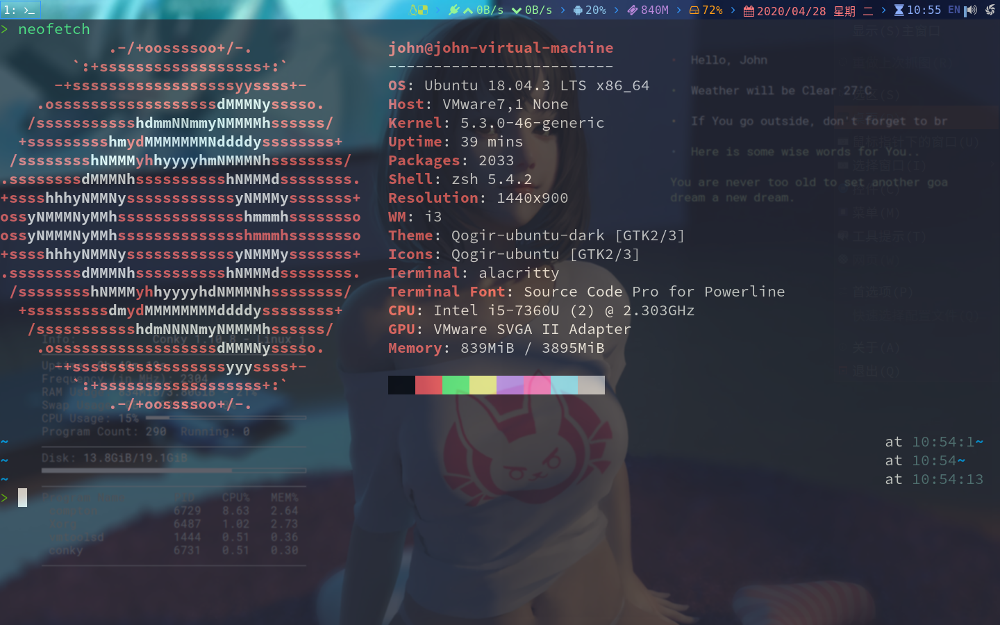

# 保存个人配置文件的仓库
* Gnome

* i3wm

## vim(nvim)
1. 安装插件管理工具vim-plug
2. 将vimrc文件替换
3. 安装插件
4. 安装cmake、python3.x-dev等工具
5. 进入目录安装YouCompleteMe

## zsh
1. 安装插件管理工具zplug
2. 替换zshrc文件
3. 安装插件和主题
4. 配置powerlevel10k（需要安装字体）
5. 安装oh-my-zsh
6. source .zshrc或者重启终端

## conky
* 使用wiki上的配置，修改为全透明背景以及显示位置
1. 配置文件地址：.config/conky/conky.conf
2. i3bar中使用的配置文件地址：.config/conky/conkyrc

## ibus-rime
1. 使用明月简体拼音输入
2. 同时使用东风破管理插件（目前只有表情插件，而且还没有生效）
3. 配置文件地址：.config/ibus/rime/
4. woc dax
5. 刚刚就现场翻车啦

## i3-gaps
1. 简单的i3配置文件，实现ubuntu+i3wm环境
2. 自定义窗口位置和工作区
3. 设置窗口间距

## compton(picom)
1. 透明管理器
2. 在i3环境中运行时2核虚拟机CPU使用率约为10%，可以设定特定程序透明和毛玻璃特性
3. 设置有很多配置，在ubuntu中编译好的包莫认可用透明gnome-terminal
4. 前一段时间会出现画面撕裂现象可能是因为xorg上游的缘故，现在已经修复，正常使用没问题了

## alacritty
1. 终端配置
2. 内存使用较高，使用GPU加速

## fcitx
1. 在i3wm中使用更好，使用ubuntu的im-config可以自动配置不同的桌面使用不同的输入法
2. 在ubuntu中apt默认安装的时fcitx4
3. 可以使用github安装新的皮肤(arch可以直接通过pacman安装)
4. 在其实用libpinyin也很简单，而且支持联想功能
5. fcitx存在一个问题，在一个窗口上使用时，一开始可能无法定位光标都位置

### ranger
1. 终端文件管理工具
2. 适用在终端工作的人
3. 其实一般我用不到，不过有的时候还是需要的
4. 但三这个可以在终端预览文件，还是很好用的

## i3和awesome桌面环境
1. i3wm我基本已经配置好了，现在显示环境也是没问题的，不过感觉还是有些地方是不对的。
2. awesome感觉配置好了也是会有不对都地方
3. 现在这个虚拟机的配置就很完美了，没有必要去折腾其他的发行版，浪费时间
4. 可以学习lua语言，配置awesome，可以在另一台虚拟机上实验，，学习一些新的东西
5. 基本是：arch、gnome、i3wm、awesome、fcitx、picom、alacritty、conky、eg.
